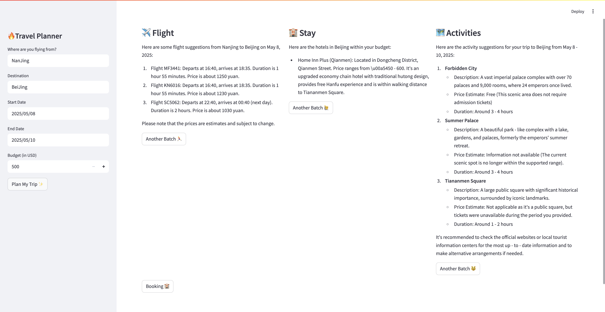
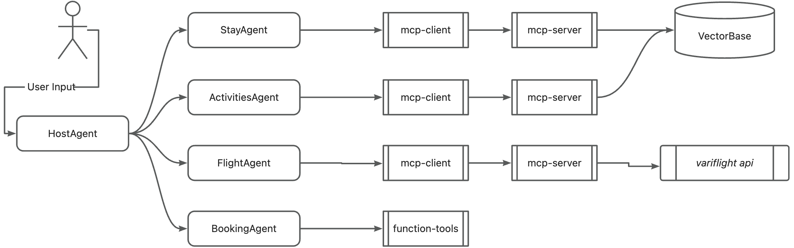

# Travel planner

A travel planner/assistant powered by [google-adk framework](https://github.com/google/adk-python)

## QuickStart

### Requirements

```bash
conda create -n travel_assistant python=3.10 -y
conda activate travel_assistant

git clone https://github.com/LotsoTeddy/travel-planner.git

cd travel-planner

pip install -r requirements.txt
```

Then, you should add your ARK API KEY to `/src/agents/model.py`.

### Start

On-click start:

```bash
bash start.sh
```

Or, you can start each agent server manually:

```bash
cd src
python3 tools/prepare/prepare_vector.py
uvicorn apis:app --port 8090 &
streamlit run travel_ui.py
```

Visit [http://localhost:8501/](http://localhost:8501/) in your browser

## Optimization

1. Change the normal model to `doubao-1-5-thinking-pro-250415`, which is a deep-reasoning model presented by Ark.
2. Change the agent execution from serial to parallel, which can reduce the execution time for nearly 3 times speedup.

## Custom

- Modify model
    - edit `/src/agents/model.py`
- Modify agent information
    - edit `/src/agents/*_agent`

## Result

The agent will run for about 3 to 5 minutes.




## Design




## Reference

This repository is built based on this [document](https://www.datacamp.com/tutorial/agent-development-kit-adk).
